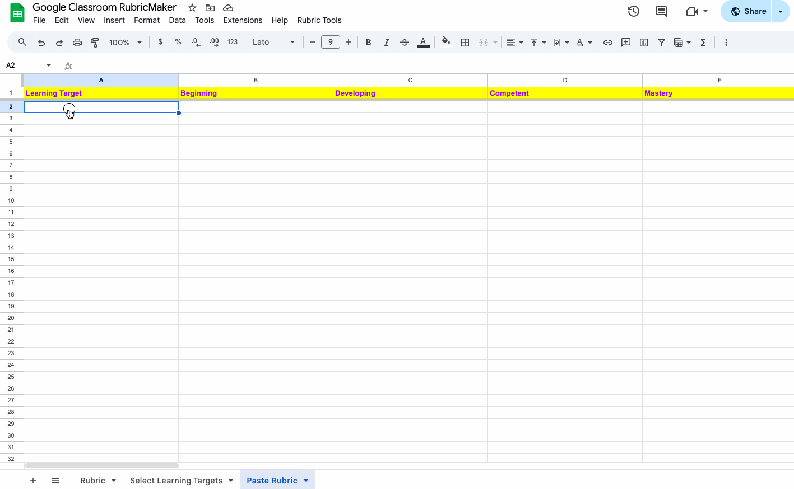

# Google Classroom RubricMaker

## Rationale
I created this to make it easier to generate rubrics in the proper format to be imported into Google Classroom. When editing an assignment, you can create a rubric but you can also import from Sheets. My script generates a Google Sheet that allows you to select certain learning targets and allow them to be imported correctly into Classroom.

## Usage
Copy the Google Sheet available here: [Google Classroom RubricMaker](https://docs.google.com/spreadsheets/d/1sMugQFmxFl5JWtNfcGzrE1Z0E_VqRskVYaMTInfQm4A/copy)

1. Paste your rubric in the format given on the "Paste Rubric" sheet.
2. Rubric Tools > Extract Learning Targets to convert your rubric and add it to the "Select Learning Targets" sheet.
3. Add in short descriptions (short descriptions allow students to see 1 or 2 word summaries of the learning target).
4. Select the learning targets you want to include for your Google Classroom Assignment by checking the checkboxes.
5. Rubric Tools > Create Rubric.
6. In Google Classroom, go to your Assignment. After entering the details of the assignment, add a rubric and select "Import from Sheets". Select the sheet you just made.

\* You can change the headings to something other than "Beginning", "Developing", "Competent", and "Mastery" and the new headings will be transferred to the "Select Learning Targets" sheet.

\* You can duplicate this sheet for different courses and generate rubrics for each course as you like.
